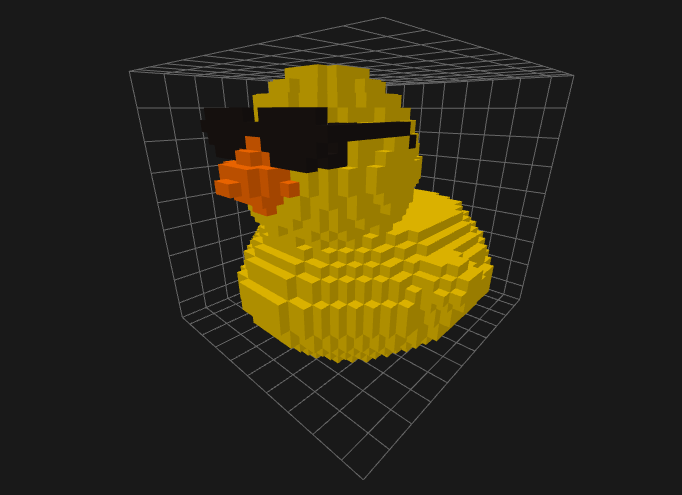
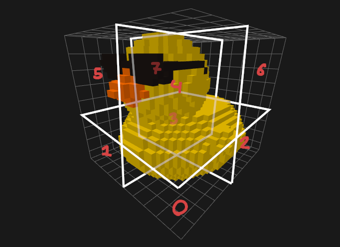

# SVO Attribute Compression

Geometry is the most important attribute, as it gives the model shape.
However, it does not inherently make up the majority of a model's information.
Whether a voxel exists or not is only a single-bit information, whereas the colors are often times a 24-bit information.
Add an alpha channel to that and various other material properties and it is plain to see that effort has to be put
into compressing these attributes as well.

## Image-Based Approach

Storing a 24-bit RGB color for every voxel would be very expensive.
What some formats such as PNG instead do is store a delta between neighboring colors.
Instead of storing deltas we could also store whether neighboring colors are exactly identical, but such a naive
approach would become very ineffective when introducing small amounts of noise into the colors.

### Primer on PNG Filtering

```
c|b
-+-
a|x
```
`x` is the color to encode and `a, b, c` are its neighbors.
In the [Filtering Section](https://www.w3.org/TR/2003/REC-PNG-20031110/#9Filters) of the PNG specification we can
see that the colors are converted to a delta-based representation relative to their neighbors.

This step however does not reduce the size of the data as "both the inputs and outputs fit into bytes".
It is merely a pre-processing step which increases redundancy in the image bytes and thus improves
[DEFLATE compression, the next step](https://www.w3.org/TR/2003/REC-PNG-20031110/#10Compression).

### Problems in Three Dimensions

Regardless of whether we want to naively store exact matches between neighbors or a delta, we run into the same
problems.

1. We might not always have a neighbor.
2. We need to cache vast amounts of data to reference neighbors.

In image formats at most, a pixel may have a zero-alpha value but it still exists in the data.
In our octree format voxels might simply not exist at all.
There is a distinct difference between an invisible voxel and a missing voxel.
However, we could still treat missing voxels as zero-colors.
Hence, this is the smaller of the problems.

The latter problem is of higher significance.
Due to our geometry encoding scheme, we would need to cache a significant portion of our model when reading it.
For instance, a voxel which lies at the origin could reference three other octants as neighbors and obtain its colors
from them.
Therefore, we must cache these octants during the reading process.
Image pixels are typically stored in such a way that you only need to store the previous and the current line to obtain
the negative neighbors of any pixel.

Since we are forced to store neighbors for random access, we have two options:

1. Store neighbors in an array, having $O(1)$ random access but $O(\infty)$ spatial cost
2. Store neighbors in an octree, having $O(\log{n})$ random access and $O(v+\log{v})$ spatial cost

### Conclusion

Our geometry-data is not arranged in a way that allows for fast random access of previously read neighbors and a low
spatial cost.
Unfortunately, we can thus not trivially extend traditional image-based approaches into three dimensions.
We must use an approach which is coupled to the octree structure instead.

## Octree-Coupled Approach

<br>
*Figure 1: A Duck Model*

Observe the above figure.
We can see that not only are there few colors in total, but we can see distinct shapes with an equal or similar color.
As described in [Properties of Voxel Models](properties.md#colorattribute-locality), voxels which are located closely
to each other also tend to have similar colors.
Our goal is to use the existing octree structure and add information to it, so that we encode attribute information
for more than one voxel at a time.

We exploit the fact that as we split up the model into smaller and smaller subtrees, the range of colors
within that subtrees will also get narrower.
By range we refer to a subsection of RGB-space.
For example, the entire model or its root node has a color range from
<span style="color: #181311; font-weight: bold">(24, 19, 17)</span>
to
<span style="color: #d4a211; font-weight:bold">(212, 162, 17)</span>.
We can obtain this range using the component-wise minimum and maximum of all colors.

<br>
*Figure 2: The Octants of a Duck Model*

When we split up the model into multiple octants, we see narrower ranges for most octants.
For example, octants 0, 1, 2, 3, 5 and 7 contain only yellow, which is
<span style="color: #c7a200; font-weight: bold">(199, 162, 0)</span>.


