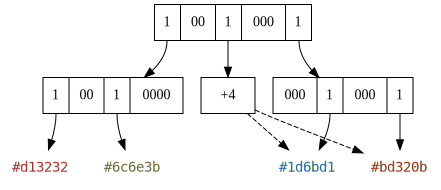

# Directed Acyclic Graph

 
*Figure 1: A Directed Acyclic Graph*

Directed Acyclic Graphs (DAGs) for voxel encoding build on the idea of octrees.
However, they allow nodes to reference the branches of other nodes.

How this may work can be seen in *Figure 1*.
The second branch of the root node stores a `+4`.
This `+4` points four nodes ahead, on the same level in the graph and tells the decoder "this node has the same content"
as the node four positions ahead.
It is a four because there are three zero bits in the root node between this node and the one it points to.
