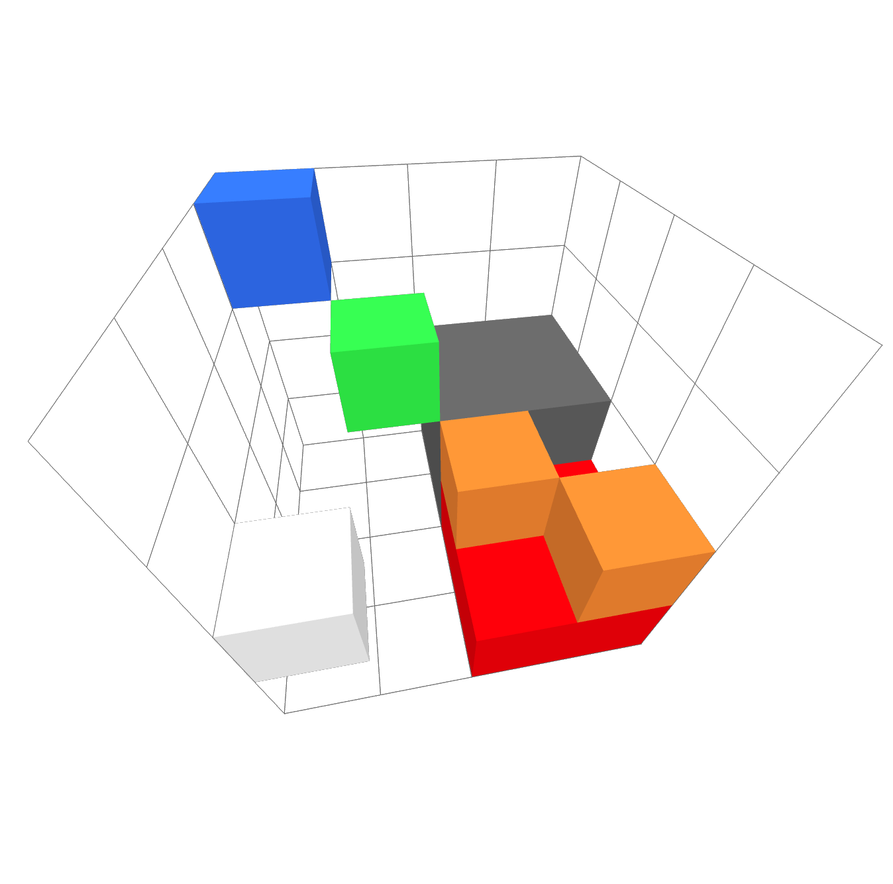
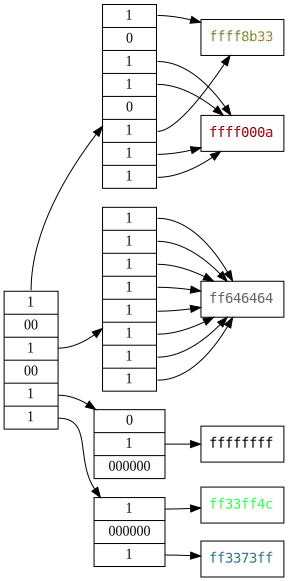
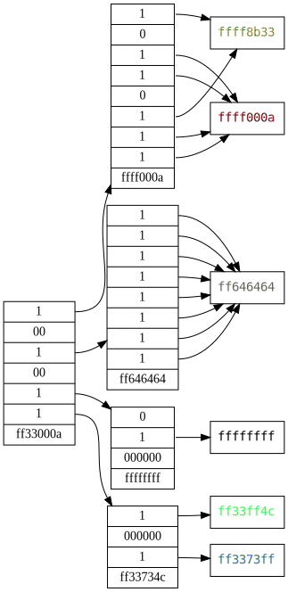
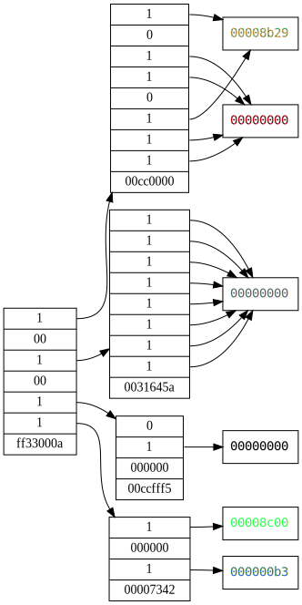

# Full Example

To better illustrate the functionality of the FLVC codec, we will walk through
a full example of encoding a VL32 file using FLVC manually.

Our test model will be the following 4x4x4 partially filled cube.
The blue voxel is the uppermost point $(3,3,3)$ and, the bottom-right, red voxel
is the lowermost point at $(0,0,0)$.

The octant containing gray voxels is completely filled, meaning it consists of
2x2x2 voxels.

<br>
*Figure 1: The test model visualized as a graph*

## VL32 Encoding

See [VL32 Specification](../file_formats/vl32.md).
This following block shows a hex-printout of the VL32 file with added comments.
Each row is one voxel.
Each voxel consist of three big-endian two-complement coordinates followed by
ARGB color bytes.

```rust
// 4 red bottom voxels
00000000 00000000 00000000 ffff000a
00000001 00000000 00000000 ffff000a
00000000 00000000 00000001 ffff000a
00000001 00000000 00000001 ffff000a
// 2 orange voxels
00000000 00000001 00000000 ffff8b33
00000001 00000001 00000001 ffff8b33
// 8 gray voxels
00000000 00000000 00000002 ff646464
00000001 00000000 00000002 ff646464
00000000 00000001 00000002 ff646464
00000001 00000001 00000002 ff646464
00000000 00000000 00000003 ff646464
00000001 00000000 00000003 ff646464
00000000 00000001 00000003 ff646464
00000001 00000001 00000003 ff646464
// 1 white voxel
00000003 00000001 00000000 ffffffff
// 1 green voxel
00000002 00000002 00000002 ff33ff4c
// 1 blue voxel
00000003 00000003 00000003 ff3373ff
```

## Conversion to FLVC Step by Step

### Header

We start out by encoding the constant parts of the header:
```rust
ff1133cc666c7663            // magic bytes
00 01                       // version 0.1
feffffff feffffff feffffff  // volume_offset = (-2, -2, -2)
                            // keep in mind these are little-endian integers
04000000 04000000 04000000  // volume_size = (4, 4, 4)
00                          // empty = false
"(def)"                     // five ASCII padding bytes
```

### Attribute Definitions

Then, we must encode the attribute definitions.
There must always be a definition for the `position` attribute.
While the type and modifiers for this attribute have no influence on the rest of
the stored data, they are necessary for the FLVC API to know the layout of
position triples when encoding and decoding a data stream.
```rust
0200               // definitions_size = 2

08                 // identifier_length = 8
"position"         // identifier
14                 // type = 0x14 = INT32
03                 // cardinality = 3
0000               // no modifiers

05                 // identifier_length = 5
"color"            // identifier
21                 // type = 0x21 = UINT8
04                 // cardinality = 4
00                 // no modifiers

"|"                // end of header, start of data
```

### SVO Processing

We must first encode our voxel data as an SVO.
We won't go into detail how to do this in this chapter.
The end result looks as follows:

<br>
*Figure 2: The test model visualized as a graph*

In this figure, we see the root node connected to four octants.
Each octant has up to eight voxels.
The topmost bit in each *child mask* represents the lowermost octant of a node.

!!! note
    For each connection to a voxel, a separate node in the SVO  is stored.
    Multiple connections to one node are only part of this visualization to save space.

There are some SVO optimizations that we have to apply for FLVC but none of them
are necessary here:

- Trimming completely filled branches would have no impact on the gray octant.
- The root node has more than octant, so the depth can not be reduced further.

The next optimization would be delta coding.
For that, we must first perform a $min$ mipmapping step.
The `color` attribute has a `cardinality` of 4.
Henceforth, the $min$ is computed for each channel of the colors.
We then delta-code the SVO by subtracting children's channels from their parents'.
Here is the result:



<br>
*Figure 3: The mipmapped (left) and then delta-coded (right) graph of the model*

### Interleaving Steps

Now, we perform *attribute de-interleaving* and *bitwise interleaving*.
Starting with the red octant:
```plain
00_00_00_00                   00 00 00 00 00 00
00_00_00_00    --dileave->    00 00 00 00 00 00
00_00_8b_29                   00 00 8b 00 00 8b
00_00_00_00                   00 00 29 00 00 29
00_00_00_00
00_00_8b_29
```
Essentially, we have turned 6 nodes with 4 attributes each into 4 sequences
with one byte for each of the 6 nodes.
The first de-interleaved row shows the alpha channel, the next is red, etc.
Another example, here in the form of the root node, which contains another 4
branch nodes:
```plain
b7 00_cc_00_00                   b7 ff 40 81
ff 00_31_64_5a    --dileave->    00 00 00 00
40 00_cc_ff_f5                   cc 31 cc 00
81 00_00_73_42                   00 64 ff 73
                                 00 5a f5 42
```

We repeat this process for all nodes.
At this point it becomes abundantly clear what the effect of these steps is.
We started out with a graph that contains a variety of different numbers and no
obvious pattern, exploitable by an entropy coder.
Now e.g. the attribute data for the red block of voxels starts with 18 zeros,
and although the effect on the branch node was less severe, we now still have
4 consecutive zeros due to uniformity in the alpha channel.

Now, the final step is *bit-interleaving*.
This means that we concatenate the least significant bit of each row, followed
by the next most significant bit, etc.
This time, we use the green and blue node as an example:
```plain
00 00 8c 00   --ileave-> 00 00 00 00 50 40 0a 8a
00 00 00 b3
```
Also see [Bitwise Interleaving](flvc_optimizations.md#bitwise-interleaving) for more examples.

### Serialization

We still need to get all of this data into a single, sequential data stream.
In the FLVC reference implementation, the interleaving steps are actually done
just-in-time when writing a node, not during optimizations.
However, this is ultimately the choice of the implementing developer.

The order of nodes in FLVC is [Accelerated Depth-First](../svo/svo.md).
When arranged in this order, the complete data stream looks as follows:
```plain
80 FF 33 00 0A 93 00 00 00 00 B7 00 40 81
00 00 00 00 02 55 22 55 CC 46 EC 4E A4 24
46 4E 00 00 00 00 00 00 00 00 00 00 00 00
24 09 90 00 00 90 24 00 90 00 09 00 00 00
00 00 00 00 00 00 00 00 00 00 00 00 00 00
00 00 00 00 00 00 00 00 00 00 00 00 00 00
00 00 00 00 00 00 00 00 00 00 50 40 0A 8A
```

### Compression

When finally compressing, we encode the data stream using zlib and append the
stream to the header directly after the `|` character, which separates header
from content.
```plain
78 DA 6B F8 6F CC C0 35 99 01 08
B6 33 38 34 82 68 A6 50 A5 D0 33
6E 6F FC 96 A8 B8 F9 31 20 01 15
CE 09 0C 0C 13 54 18 26 30 70 32
10 0B 02 1C B8 BA 00 13 57 0B 6C
```
You can access the complete file for your own purposes here:
[Download](../assets/test_model.flvc)
