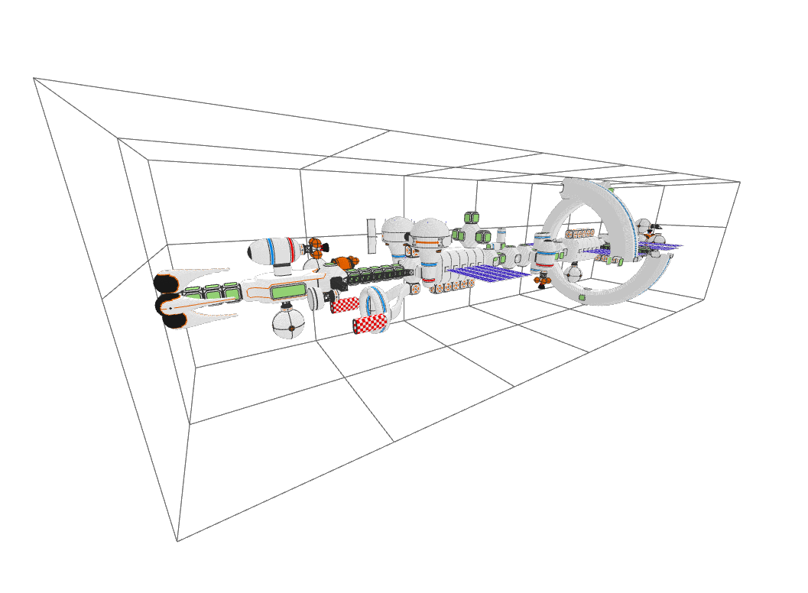
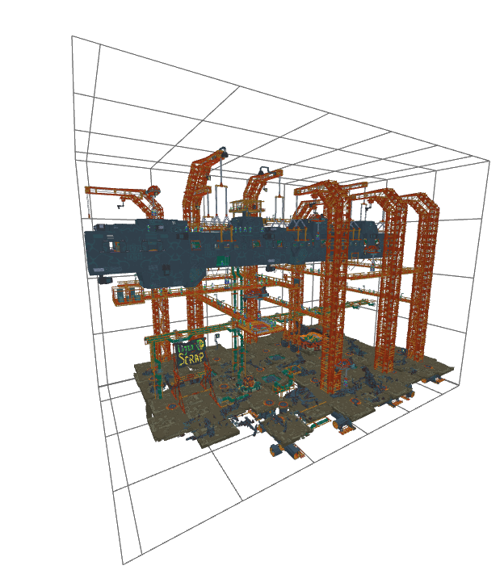
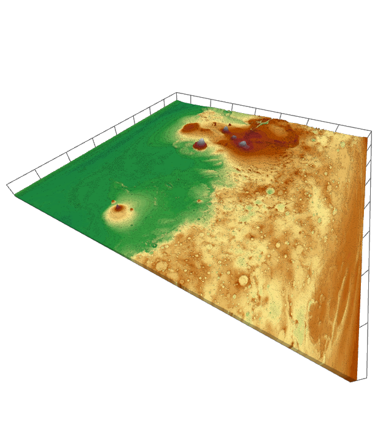

# FLVC Performance, Conclusions

## Examples

In the following section, we will look at three concrete examples of real world
performance of the FLVC codec.

!!! note
    All test were performed on the ramdisk of a Debian 11 Desktop. 
    **Processor:** Ryzen 9 3900X 
    **Memory:** 64 GiB 3200MHz

### Spacestation

<table>
<tr><th>Voxels</th><td> 923,566 V</td></tr>
<tr><th>Raw Size</th><td> 14,777,056 B</td></tr>
<tr><th>Encoded Size (FLVC-6)</th><td>(3.34%) 500,812 B</td></tr>
<tr><th>Encoded Size (FLVC-9)</th><td>(3.33%) 493,409 B</td></tr>
<tr><th>Encoding Duration (FLVC-6)</th><td> 1679 ms</td></tr>
<tr><th>Encoding Duration (FLVC-9)</th><td> 2130 ms</td></tr>
</table>

### Scrapyard

<table>
<tr><th>Voxels</th><td> 24,423,655 V</td></tr>
<tr><th>Raw Size (VL32)</th><td> 390,778,480 B</td></tr>
<tr><th>Compressed Size (FLVC-6)</th><td>(1.71%) 6,682,496 B</td></tr>
<tr><th>Compressed Size (FLVC-9)</th><td>(1.69%) 6,602,502 B</td></tr>
<tr><th>Encoding Duration (FLVC-6)</th><td> 38 s</td></tr>
<tr><th>Encoding Duration (FLVC-9)</th><td> 44 s</td></tr>
</table>

### Mars Heightmap
</td></tr>

<table>
<tr><th>Voxels</th><td> 101,244,604 V</td></tr>
<tr><th>Raw Size</th><td> 1,619,913,664 B</td></tr>
<tr><th>Encoded Size (FLVC-6)</th><td>(0.90%) 14,616,607 B</td></tr>
<tr><th>Encoded Size (FLVC-9)</th><td>(0.86%) 13,914,269 B</td></tr>
<tr><th>Encoding Duration (FLVC-6)</th><td> 149 s</td></tr>
<tr><th>Encoding Duration (FLVC-9)</th><td> 163 s</td></tr>
</table>

## Conclusions

##### Compression Ratio

Free Lossless Voxel Compression delivers impressive results.
Even for the smaller and somewhat less redundant models, we need less than one
byte per voxel despite starting with 16 bytes per voxel (`x, y, z, argb`).
At best, the file size is reduced by over 99%.
It must be emphasized that in related work, the reference point is typically a
voxel array where only a minuscule fraction consists of voxels.
Here, the reference point is a list of voxels with no empty space between.

The level of compression has little impact on the size of the produced filed.
At best, a 10% reduction ca be seen, at worst, almost none.

##### Time

Execution time can be perceived as excessive for very large models.
As can be concluded from previous sections, most of this time is spent reading
in VL32 data and constructing the SVO.
For example, of the 149 seconds to encode the heightmap at level 6, 108 were
spent constructing the SVO.
This is a problem that can not be easily resolved algorithmically and is
inherent to manipulating large quantities of data.
Once again, the compression level has comparably little impact: here on the
encoding duration.

##### Further Improvements

Some compression ratio improvements could be achieved by choosing a different
entropy coder.
For example, [Facebook's Zstandard](https://github.com/facebook/zstd) is a more
recent and promising technology than zlib.
A slight improvement in compression speed is also likely.

However, the biggest bottleneck as of now is the time it takes to construct
the SVO while also reading VL32 data.
A potential solution would be to use multiple threads: One for reading the
VL32 file and one for constructing the SVO.
At most, this would reduce the duration of first part of FLVC encoding by 50%.

Another potential approach would be to create multiple, independent volumes,
which are all encoded by a separate thread.
Potentially, separate zlib streams could be created as well to avoid a
bottleneck during entropy coding.
However, this would require further modifications of the FLVC standard and is
not possible merely by optimizing the reference implementation.
