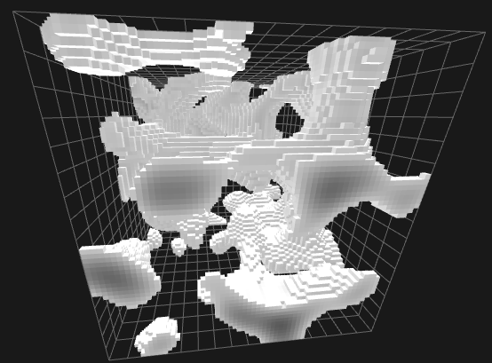
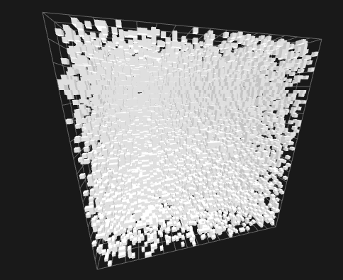
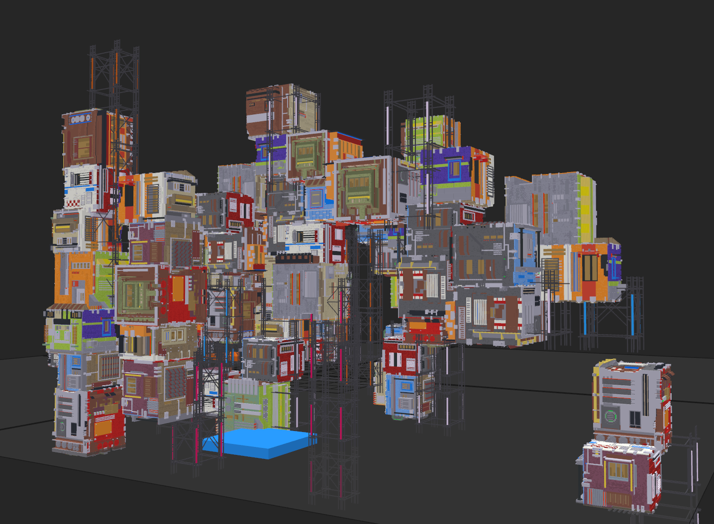

# Properties of Voxel Models

The cornerstone of compression is discovering and eliminating redundancies in data.
We must first recognize these redundancies by observing the nature of voxel models.
There are plenty of properties which we can exploit, as described in the following sections.

## Geometric/Spatial Locality

 
*Normalized 3D Perlin Noise with a threshold of 0.4*

Voxels rarely come alone.
All 3D models will typically take some distinguished shape.
There will be large areas with filled geometry (voxels) and large empty areas, *air*, or *void*.
In artistic circles these are often described as [negative space](https://en.wikipedia.org/wiki/Negative_space).

 
*Uniform voxel noise with a probability of 0.1 that a voxel is set*

The only kind of model which has no spatial locality whatsoever would be uniformly distributed noise. (see above)
These kinds of models are the absolute exception and are rarely if ever seen.

### Conclusion

Compression schemes have to be able to describe large volumes of positive and negative space efficiently.

## Color/Attribute Locality

*"Ragged Cluster" model visualized in Magica Voxel*

Color and other attributes such as normals correlate with geometry.
This means that the color distance between neighboring voxels is significantly lower than the distance of random points
in RGB space.

In fact, this correlation is dramatically high.
For the above model, the average euclidean distance of any unique pair of neighboring voxel colors
$(0, 0, 0) \le (r, g, b) \le (255, 255, 255)$
is $8.56$.
Normalized for positions in a unit cube instead this is $0.03357$.

For uniform random colors, this distance would be equal to
[Robbin's Constant](https://mathworld.wolfram.com/RobbinsConstant.html) which is roughly equal to $0.66170$, almost
20 times higher.

### Conclusion

Compression schemes should make use of geometric encoding and attach attributes on top of that.
Alternatively voxel compression schemes should encode attributes in a fashion very similar to geometry.

## Color Sparsity

While in principle, plenty of software supports 24-bit True Color RGB or even wider standards, only a small amount of
colors are actually used.
Especially in the field of *Voxel Art*, the 3D-equivalent to [Pixel Art](https://en.wikipedia.org/wiki/Pixel_art),
small palettes are used.
To name an example, [Magica Voxel](https://ephtracy.github.io/) supports 255 unique colors but each individual color
is a 24-bit True Color.

### Conclusion

Compression schemes should be aware of potentially very low color counts and exploit these by building a palette.
A palette will not always be beneficial since in principle, any amount of colors should be present.
However, in many cases this will be beneficial.
