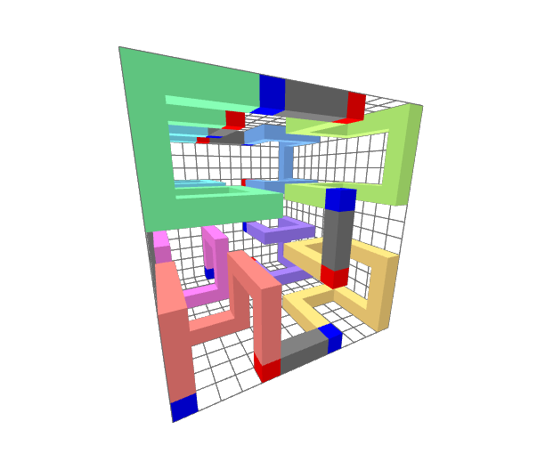

# 3D Hilbert Curves

## Properties

Hilbert curves are space-filling curves with numerous properties, beneficial for storage of multi-dimensional data.
Let a Hilbert curve be a sequence $h_n(i): \mathbb{N} \rightarrow \mathbb{N}^3$ where $n \in \mathbb{N}$ is the
iteration of the curve.

- the previous element $h_n(i-1)$ is always a direct neighbor to any element of the curve $h(i)$
- the Manhattan distance of $h_n(i-2)$ is always 2
- the Manhattan distance of $h_n(i-3)$ is either 1 or 3
- it is possible to access elements $h_n(i)$ randomly with $O(n)$ complexity
- it is possible to access the index $h^{-1}_n(p)$ of any point randomly with $O(n)$ complexity

## Computing Hilbert Curves

In this section, we will discuss how to compute elements of the Hilbert curve $h(i)$.
In principle, the method to construct a Hilbert curve is as follows:

1. Choose a base shape $h_0(i), \; 0 \le i \lt 8$ that fills a 2x2x2 space (this is the first iteration)
2. Find a table of rotations $R$ so that a 2x2x2 block $h_1(j)$ of $h_0(i)$ resembles $h_0(i)$ at a coarser level
3. Use $R$ to rotate shapes $h_0$ so they form one continuous curve

The first two steps are just preparation.
The last step needs to be performed recursively.
Our goal is to rotate eight 2x2x2 pieces so that they form one continuous curve with the same coarse path as the shapes
themselves.
We then have a 4x4x4 shape with starts and ends in the same corners, allowing us to rotate it using *exactly* the
same rules and connect it with seven more shapes to obtain an 8x8x8 shape etc.
Due to this similarity between iterations, we only need a single base shape $h_0$ and rotation table $R$.

### Preparation

As described, we must first find a fitting shape $h_0$ and a rotation table $R$.

<br>
*Figure 1: First Iteration of a 3D Hilbert Curve*

There are three shapes which can form a Hilbert curve, but this one in particular has properties that make it suited
for high performance computing.
In this case, we simply use a Gray Code of length 8, of which the three bits of each element are interpreted as
coordinates.

<br>
*Figure 2: Second Iteration of a 3D Hilbert Curve*

Now, we come up with a rotation table $R$ with 8 rotations $R_i, \;0 \le i \lt 8$ for each of the 8 blocks $h_1(i)$.
The blue voxel represents the first element of each block and the red element represents the last.
Note how the global end and start voxels are in the same corners of the model in both the first and second iteration.
Also note that the path taken through the blocks $h_1(8i)$ is identical to the path taken within the shape $h_0(i)$.
This is what it means that the blocks resemble the shape at a coarser level.

Finding a rotation table $R$ with such properties can be done using a brute-force algorithm.

### Algorithm

Computing Hilbert curves is greatly simplified when first computing a Morton (Z-Order) curve and permuting its elements.
A Morton curve also traverses space in 2x2x2 blocks recursively, but lacks many of the properties we discussed earlier.
3D Morton curves can be computed by simply interleaving the bits of any coordinate triple $(x, y, z)$, yielding a single
number.
With this intermediate step of morton-coding, our pseudo-code looks like this:
```cpp
vec3<unsigned> hilbert_to_xyz(unsigned hilbert, unsigned iteration)
{
    unsigned morton = hilbert_to_morton(hilbert, iteration);
    vec3<unsigned> xyz = deinterleave3(morton);
    return xyz;
}

unsigned xyz_to_hilbert(vec3<unsigned> xyz, uint iteration)
{
    unsigned morton = interleave3(xyz.x, xyz.y, xyz.z);
    unsigned hilbert = morton_to_hilbert3(morton, iteration);
    return hilbert;
}
```

As described earlier, we need to recursively apply our rotation table to blocks of 2x2x2 each.
When our input is already morton-coded, each octal digit represents a position on one level of an octree.
This means that we just need to rotate each digit correctly.
A pseudo-code implementation of a hilbert_to_morton function looks as follows:

```cpp
unsigned hilbert_to_morton3(unsigned hilbert, unsigned iteration)
{
    for (unsigned i = 0; i < iteration; ++i) {
        unsigned octal_digit = get_octal(hilbert, i);
        set_octal(hilbert, i, hilbert_to_morton_shape[octal_digit]);
    }

    unsigned first_digit = get_octal(hilbert, iteration);
    mat3 next_rot = rotation_table[first_digit];

    for (unsigned i = iteration; i != 0; --i) {
        unsigned morton_digit = get_octal(hilbert, i - 1);
        unsigned rotated_digit = interleave3(next_rot * deinterleave3(morton_digit));
        set_octal(hilbert, i -1, rotated_digit);

        next_rot = next_rot * hilbert_to_morton_rotations[morton_digit];
    }

    return hilbert;
}
```

In the first loop, we simply perform our shape transform to each digit.
This means that each hilbert-coded digit gets mapped onto a morton-coded digit.
In the second loop, we apply the rotation of more significant digits to less significant digits.
For non-linear transformations, we would have to use a nested loop and iterate over all the less-significant digits.
However, in this case we only apply rotations and we can multiply the rotation matrices instead, exploiting
associativity of matrix multiplication:
\[M_1 (M_0 p) = (M_1 M_0) p\]
Note that our rotation table needs to be indexed using morton-coded digits.

```cpp
unsigned hilbert_to_morton3(unsigned hilbert, unsigned iteration)
{
    for (size_t shift = 0; shift < iteration * 3; shift += 3)
        unsigned hilbert_digit = (hilbert >> shift) & 0b111;
        unsigned morton_digit = hilbert_to_morton_shape[hilbertCodedDigt];
        hilbert ^= (hilbert_digit ^ morton_digit) << shift; // replace digit in result
    }

    unsigned shift = iteration * 3;
    unsigned first_digit = (hilbert >> shift) & 0b111;
    mat3 next_rot = hilbert_to_morton_rotations[first_digit];

    while (shift != 0) {
        shift -= 3;
        unsigned morton_digit = (result >> shift) & 0b111;
        unsigned rotated_digit = interleave3(next_rot * deinterleave3(morton_digit));
        hilbert ^= (mortonDigit ^ rotated_digit) << shift;  // replace digit in result

        next_rot = next_rot * hilbert_to_morton_rotations[morton_digit];
    }

    return hilbert;
}
```
