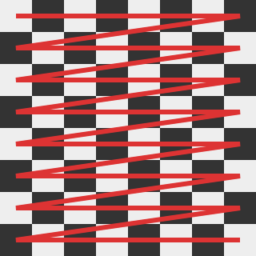
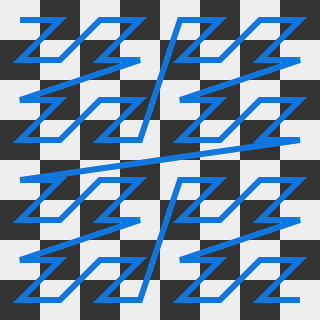
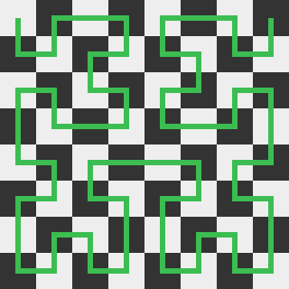
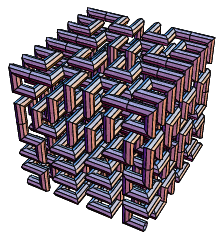

# Space-Filling Curves

A space-filling curve is a curve which's range contains the entirety of a hypercube
When filling space with a curve, we are generally applying a bijective function:

$$c: \mathbb{N} \rightarrow \mathbb{Z}^N,\; N \in \mathbb{N}$$

This maps discrete points of the curve onto points in (hyper)space.
Note that often times it may be easier to iterate over all points in space and assign an index to each instead.
Since our mapping is bijective, this is also a viable strategy for filling space, as long as we are working within
finite boundaries.
In such a case, we are applying the inverse function:

$$c^{-1}: \mathbb{Z}^N \rightarrow \mathbb{N},\; N \in \mathbb{N}$$

For the sake of simplicity, we will only be discussing three-dimensional space-filling curves
$c:\mathbb{N} \rightarrow \mathbb{Z}^3$

## Motivation

In the previous [RLE](rle.md) methods, we have filled space using nested iteration.
Using alternative space-filling curves improves spatial locality over nested iterations.
This is expected to improve the compression ratio of RLE.

## Comparison of Space-Filling Curves

We will be discussing three approaches, namely *nested iteration*, *Z-Order Curves*, and *Hilbert Curves* for use in RLE.
First, we introduce, define and present an implementation of all three methods.
Then, we compare them.

One of the points of comparison is how frequently a *jump* is found in the curve.
The set of jumps $J(c)$ for a curve $c$ is defined as:
$$J(c) = \{(i,j) \in \mathbb{N}\times\mathbb{N} \;\big|\; \lVert c(j) - c(i)\rVert \gt 1\}$$
The only curves without jumps are curves of which all points are direct neighbors.

!!! note 
    There are many more possible space-filling curves.
    Just by permuting coordinates we could obtain six variations of each of our curves.
    The three chosen examples were selected because they have significant advantages and disadvantages over one-another
    and thus act as a good proxy for comparison of all space-filling curves.
!!! note
    Z-Order Curves are also known as *Lebesgue curve*, *Morton Space-Filling Curve*, *Morton Order* or *Morton code*.

### Nested Iteration

<br>
*Figure 1: Nested Iteration in Two Dimensions*

Let $l_x, l_y, l_z \in \mathbb{N}$ be the dimensions of the volume to fill.
Our curve can be defined as:
$$c(i) = \begin{pmatrix}
i \bmod (l_x \cdot l_y) \cr
\lfloor\frac{i}{l_x}\rfloor \bmod l_y \cr
\lfloor\frac{i}{l_x \cdot l_y}\rfloor
\end{pmatrix}$$

It is however much simpler to perform the inverse mapping:
$$c^{-1}(x, y, z) = x + (y \cdot l_x) + (z \cdot l_x \cdot l_y)$$

For a cube with dimensions which are powers of two, this is equivalent to concatenating the bits of $x$, $y$ and $z$
of any point.
Nested iteration fills space by iterating over all coordinates, with $x$ running the fastest, followed by
progressively slower-running coordinates.

The reverse-approach can be performed without any multiplication at all, using the following code:
```cpp
voxel container[limit_x * limit_y * limit_z];
size_t index = 0;
for (unsigned z = 0; z < limit_z; ++z)
    for (unsigned y = 0; y < limit_y; ++y)
        for (unsigned x = 0; x < limit_x; ++x, ++index)
            container[index] = voxel_at(x, y, z);
```

Notice how our container can have any shape, it is not limited to a hypercube.
A *jump* occurs once every `limit_x` coordinates, where `x` jumps from `limit_x - 1` to `0`.

### Z-Order Curves

<br>
*Figure 2: Z-Order Curve in Two Dimensions*

Z-Order Curves have already been presented as a possible solution
[in 1996 by G.H. Morton](../related/literature.md#a-computer-oriented-geodetic-data-base-and-a-new-technique-in-file-sequencing).
They have the significant advantage of a higher spatial locality.
Z-Order Curves can be constructed iteratively by repeating the *z-pattern* each 2<sup>N</sup> iterations, recursively.

For three dimension, they can be defined as follows:
$$\begin{align}
c(i) &= \text{deinterleave}_3(i) \\
c^{-1}(x, y, z)  &= \text{interleave}_3(x, y, z)
\end{align}$$

The operations $\text{interleave}_3$ and $\text{deinterleave}_3$ are the basis for
[Octree Node Indices](../svo/construction.md#octree-node-index).
They (de)interleave the bits of the three coordinates, producing a single index which consists of a series of
octal digits.
See the linked section for an efficient implementation and thorough explanation.

The space-filling itself can be implemented very similarly to nested iteration.
We can implemented Z-Order Curves as follows:
```cpp
voxel container[limit * limit * limit];
for (unsigned z = 0; z < limit; ++z)
    for (unsigned y = 0; y < limit; ++y)
        for (unsigned x = 0; x < limit; ++x)
            container[interleave3(x, y, z)] = voxel_at(x, y, z);
```
Note that our container now needs to be a cube and also must have dimensions which are a power of two.

Interleaving bits is still the most expensive arithmetic operation performed here.
A typical implementation will interleave each coordinate with zeros first, then combine these partial results using a
bitwise OR.
Only `x` changes every iteration, so we can cache the results for `y` and `z`.
We can perform fewer operations in total using the following code:
```cpp
voxel container[limit_x * limit_y * limit_z];
size_t index = 0;
for (unsigned z = 0; z < limit_z; ++z) {
    // assuming this is implemented as a special case which handles zero-inputs
    unsigned zi = interleave3(z, 0, 0);
    for (unsigned y = 0; y < limit_y; ++y) {
        unsigned yi = interleave3(0, y, 0);
        for (unsigned x = 0; x < limit_x; ++x, ++index) {
            unsigned xi = interleave3(0, 0, x);
            container[zi | yi | xi] = voxel_at(x, y, z);
        }
    }
}
```

### Hilbert Curves

<br>
*Figure 3: Hilbert Curve in Two Dimensions*

Hilbert Curves also improve spatial locality similar to Z-Order curves.
They are very similar to *Z-Order Curves* in the aspect that they also have a pattern for each 4 pixels (or 8 voxels)
which is repeated recursively to construct the curve.
However, Hilbert curves also require these units to be rotated depending on their position in the grid at a higher
level.
Despite that, we can construct Hilbert curves from *Z-Order Curves*.
An efficient implementation of this
[was provided by *Icabod*](http://and-what-happened.blogspot.com/2011/08/fast-2d-and-3d-hilbert-curves-and.html).

<br>
*Figure 4: A Hilbert Curve in Three Dimension - Michael Trott, in The Mathematica GuideBook for Programming*

The implementation builds on our approach for Z-Order Curves.
It can also be optimized by caching portions of our Morton (Z-Order) index, but the final conversion to our Hilbert
index must happen in its entirety every loop.
```cpp
voxel container[limit * limit * limit];
for (unsigned z = 0; z < limit; ++z) {
    for (unsigned y = 0; y < limit; ++y) {
        for (unsigned x = 0; x < limit; ++x) {
            unsigned morton_index = interleave3(x, y, z);
            unsigned hilbert_index = morton_to_hilbert3d(morton_index);
            container[hilbert_index] = voxel_at(x, y, z);
        }
    }
}
```

### Comparisons

| | Nested Iteration | Z-Order Curve | Hilbert Curve
| ----- | ----- | ----- | ----- |
| Complexity per Voxel | $O(1)$ | $O(\log{b})$ | $O(b)$
| Container Restrictions | | cube with dims. 2<sup>n</sup> | cube with dims. 2<sup>n</sup>
| Jumps | each $l_x$ iterations | each 2 iterations | never
| Implementation Effort | low | medium | high

Z-Order Curves have logarithmic complexity.
However, hardware may support bit-(de)interleaving via a dedicated instruction which can be implemented very easily
by rewiring bits.
This can effectively turn the complexity to $O(1)$, should such hardware support exist.

Also note that while Z-Order curves have very frequent jumps, the most frequents ones (each 2 iterations) are
short, 2D-diagonal jumps covering a distance of $\sqrt{2}$.
Each 4 iterations, there is a longer 3D-diagonal jump of $\sqrt{3}$.
Each 8 iterations, there is an even longer jump, and so forth.

Unlike the simple `interleave3` operation for Z-Order curves, we can not easily hardware-optimize `morton_to_hilbert3d`.
Each computed octal digit affects the transformation applied to less significant digits.
This recursive dependency leads to a complexity of $O(b)$

## Impact on Run-Length Encoding

The impact on RLE can be very positive or very negative depending on the used method.
In the following table, we compare how our geometry compression methods are affected by the different curves:

| Method\Size For| Nested Iteration | Z-Order Curve | Hilbert Curve |
| ----- | ----- | ----- | ----- |
| Binvox          | 177 KB | 258 KB | 184 KB
| Compact Binvox  |  89 KB | 134 KB |  98 KB
| Complete Binvox | 254 KB | 123 KB | 109 KB
| In-Band         | 185 KB |  93 KB |  77 KB

The surprising effect is that for our bitwise formats *Binvox* and *Compact Binvox*, the effect is negative.
For byte-based formats like *Complete Binvox* and *In-Band*, the effect is positive.

### Negative Impact on Bitwise Formats

The reason why bitwise formats are negatively impacted by higher spatial locality is that they rarely profit from
its advantages but are very negatively impacted by its disadvantages.
The main disadvantage which is a potentially higher *transition rate* is explained as follows:

For bitwise, out-of-band RLE formats, it is possible to determine number of encoded markers using only the number of
transitions $t$ and the number of bits in the stream $b$ (assuming, there is no size limit for the count stored in a
marker).
A transition occurs when a one-bit is followed by a zero-bit or a zero-bit is followed by a one-bit.
When we run-length-encode a bitstream, we only need to encode a new marker for a transition.
If all bits were equal, we would only need to encode a single marker storing the size of the bitstream and the value
of said bit.

Let $t$ be the number of transitions and $b$ the total number of bits in a stream.
The *transition rate* is $t_r = \frac{t}{b}$ and the average run length $r_\oslash  = t_r^{-1} = \frac{b}{t}$.
We see the following results for our curves when iterating over our *Perlin128* model:

| Stat\Method | Nested Iteration | Z-Order Curve | Hilbert Curve |
| ----- | ----- | ----- | ----- |
| $t$ (lower is better) | 88936 | 125046 | 88410
| $t_r$ (lower is better) | 0.042 | 0.0601 | 0.042
| $r_\oslash$ (higher is better) | 23.58 | 16.64  | 23.72

The transition rate is very negatively impacted by Z-Order Curves.
This happens because the very frequent jumps which occur in Z-Order Curves will produce significant amounts of
transitions from inside a shape (1) to outside a shape(0) at its boundaries.

Note that Hilbert Curves have a lower transition rate **but still** negatively impact our bitwise formats.
This only happens because with Hilbert Curves, we run out of space in our one-markers
(8 bits for *Binvox*, 7 bits for *Compact Binvox*) more frequently due to how efficient this reordering is.
So ironically, better is worse in this case.

### Positive Impact on Bytewise Formats

In the previous section, I mentioned that bitwise formats rarely profit from the advantages of spatial locality.
Bytewise formats do profit and perform much better as a result.

The primary effect of higher spatial locality is a "clumping" of transitions.
While the number of transitions $t$ may not be affected, sections of our model with more transitions will be placed
closer together and sections with fewer transitions will also be placed together.
This is reflected by another stat, the *transition follow-up rate* $t_f$, defined as follows:
$$\begin{align}
\text{is_transition}(i) &= (\text{voxel_exists}(c(i)) \ne \text{voxel_exists}(c(i - 1))) \\
\text{is_follow_up_transition}(i) &= \text{is_transition}(i) \land \text{is_transition}(i-1) \\
t_f &= \frac{\lvert\{0 \le i \lt b | \text{is_follow_up_transition}(i)\}\rvert}{t}
\end{align}$$
In other words: the probability that a transition is followed-up by another transition.

Here the results for our *Perlin128* model:

| Stat\Method | Nested Iteration | Z-Order Curve | Hilbert Curve |
| ----- | ----- | ----- | ----- |
| $t_f$ (higher is better) | 0.01402 | 0.4346 | 0.2885

Bytewise formats do profit from a higher $t_f$, for a constant $t$.
They can simply encode a byte with a run-length of one which stores multiple transitions.
This leaves other areas which have very few transitions and can be encoded with longer runs.
Bitwise formats can not do this and need a separate marker for every single transition.

!!! note
    It is not required for a RLE format to encode 8-bit values to take advantage of a higher $t_f$.
    Any number of bits greater than one is sufficient.

## Summary

We compared *nested iteration*, *Z-Order Curves* and *Hilbert Curves* for use in RLE.
The impact of different space-filling curves was dramatic.
Bytewise formats such as *Complete Binvox* and *In-Band* performed worse with just nested iteration but saw
reductions in data of nearly 60% when using the latter methods.

Surprisingly, the previously better-performing bitwise formats did not see any benefit.
In fact, they became more redundant when using the latter space-filling curves.
This phenomenon was investigated and explained by demonstrating that only the number of transitions affects the number
of markers and thus the data size for bitwise formats.
In particular, *Z-Order Curves* negatively impact the number of transitions.

In total, we were able to achieve a reduction of 13% in data size using *Hilbert Curves* and *In-Band* over the
previously best method, *Compact Binvox* with *Nested Iteration*.
Unfortunately, the computational effort of *Hilbert Curves* puts into question whether a use of this method is
desired.
