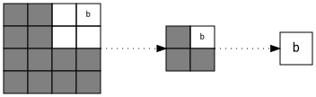

# SVO Construction

When constructing an SVO from a [voxel list](../uncompressed.md), the complexity of this process depends on the data
fed to the constructing algorithm.
Within the scope of this project, the [uncompressed format is a list of voxels](../uncompressed.md), but there are
further subtle differences.

##### Summary of Construction

The following process must be repeated for all voxels $v := (p := (x, y, z),  c) \in (\mathbb{Z}^3, \mathbb{N})$ in the
list.

1. [Test signed input position](#efficient-boundary-test) $p$ against current SVO dimensions $d$.
2. If the position is outside of our boundaries, [enlarge the SVO to fit $p$.](#octree-growth)
3. [Subtract $p_{min}$ of the SVO](#position-normalization) from $p$ to obtain $p_{\text{normalized}}$.
4. Convert $p_{\text{normalized}}$ to the [octree node index](#octree-node-index) $n$.
5. Use $n$ to [traverse the SVO](#traversing-the-octree) and insert the voxel at the correct location.
6. Optional: If only one octant is used, [cut branches belonging to other octants](#octree-optimization) recursively.

!!! note
    To handle signed values, the octree must be extended into both positive and negative octants.

##### Coordinate System

There are two coordinate systems with which we must concern ourselves with:

- *world coordinate system (signed)*
- *SVO coordinate system (unsigned)*

The conversion between these two coordinate systems occurs in step 3.

The problem which we face is that our SVO is meant to split the world coordinate system into eight equal octants,
recursively.
The first split occurs at the origin however, the origin $(0, 0, 0)$ must be located in one of these octants.

To solve this, we put the origin into the first octant; then all positions with no negative coordinates will lie in just
one octant.
This allows us to perform the optimisation from step 6 for only unsigned coordinates.
It also helps us optimize our [boundary test](#efficient-boundary-test).

As a result, for example, an SVO that can contain 4x4x4 voxels will have space from $(-2, -2, -2)$ to $(1, 1, 1)$.

##### Special Case Where Voxel Coordinates Are Positive

If the voxels are sorted with the first voxel being the most negative corner of the model, we have a global $p_{min}$
(see step 3.).
All voxels can then be translated by $-p_{min}$, yielding only positions that belong in the first octant.
If $x, y, z$ are already guaranteed to be positive, this condition is obviously also met.
In such cases. step 1. and 2. are simplified and step 6. is eliminated.

## Efficient Boundary Test

To check whether a point lies within our SVO, $max(abs(x), abs(y), abs(z)) > d$ would suffice.
However, this test is overly pessimistic because we have more negative space instead of positive space.
Also, assuming no compiler optimisations, we have to perform six conditional operations:

- each call to `abs()` requires one conditional operation
- a three-argument `max()` would require two more
- one more conditional operation is necessary for the $> d$ comparison

Assuming unsorted inputs, these six conditional jumps may wreak havoc on the performance of the
[branch predictor](https://en.wikipedia.org/wiki/Branch_predictor).

To remove the pessimism from our test, we define a new function to be used in stead of $abs$:
$$
abs_{\text{SVO}}(n) =
\begin{cases}
    -n - 1,& \text{if } n < 0\\
    n,              & \text{otherwise}
\end{cases}
$$

### Implementation

```cpp
uint32_t abs_svo(int32_t n)
{
    return n < 0 ? (-n -1) : n;
}

bool comp_against_svo_bounds(int32_t x, int32_t y, int32_t z, uint32_t d)
{
    return (abs_svo(x) | abs_svo(y) | abs_svo(z)) >= d;
}
```

Such an implementation eliminates five out of six conditional operations on modern compilers, leaving only the final
`>=` comparison.
See [this Compiler Explorer page](https://godbolt.org/z/K2CCmU) for an example.

#### Compiler Optimization of `abs_svo`

Using $abs_{\text{SVO}}$ actually works in ours and the compiler's favor.
This is due to the fact that negating a number in two's complement requires a bitwise negation and an increment.
Due to our decrement of the negated number, we eliminate this need.

```asm
abs_svo(int):
  mov eax, edi  # copy function parameter into result register
  sar eax, 31   # fill the register with 1s if the number is negative, else with 0s
  xor eax, edi  # xor result register with parameter, performing a conditional bitwise NOT
  retn          # return from the function
```

#### Manual Optimization of Comparison with `d`

This only works because $d$ is an SVO dimension and thus always guaranteed to be a power of two.
The most significant bit of lower numbers is lower than the single bit of a greater power of two.
To name an example, 128 will have the 128-bit set, whereas all lower numbers will consist only of less significant bits.
Hence, they can be safely combined with an `|` operation before making the comparison.

### Summary

The overly pessimistic initial comparison could be fixed with -surprisingly- no performance impact.
Out of the six necessary conditional operations, we could optimize five away.
During a microbenchmark of the original $max(abs(x), abs(y), abs(z)) > d$ comparison vs. our optimized method, **no
performance difference could be found**.
However, keep in mind that `abs()` functions are often compiled to use a conditional move instruction which can be
expensive on older architectures.
So depending on the architecture, such a benefit could be seen.

## Octree Growth

If we do find that a point which is to be inserted does not fit within the current octree, we must enlarge it.

### Single-Octant Growth

<br>
*Figure 1: Simple (Single-Octant) Octree Growth*

If only one octant is used, e.g. all positions are unsigned, then we can enlarge the octree into just one direction.
The current root node goes into the lowest corner (with index 0) of the new, higher-level root node.

### Unilateral Octree Growth

<br>
*Figure 2: Unilateral Octree Growth*

If we use signed positions, we must grow our octree unilaterally.
This means that each node receives a new parent.
The four new parents are then moved into the root node at the location of their children.
Here is an implementation in pseudo-C++:

```cpp
for (size_t i = 0; i < 8; ++i) {
    if (root.has(i)) {
        auto parent = make_new_branch();
        parent[~i & 0b111] = root.extract(i);
        root[i] = parent;
    }
}
```
Within each new parent, the current nodes end up positioned in the opposite corner of where they were before.
In one index from 0 to 7, each bit represents a three-dimensional coordinate.
So index `4 = 0b010` represents $(0, 1, 0)$.
By flipping all bits of the index we can quickly calculate the position inside the new parent.

Note that for [squashed octrees](svo.md#squashed-octrees), this beautifully simple case no longer applies.
We still create exactly eight new parents, but each parent will receive up to 4 of the 16 first-level branches.
This and other problems make unilateral growth for squashed octrees a lengthy and complicated process.

## Position Normalization

Once the octree has grown to a size at which it can contain our new position $p = (x, y, z)$, we must normalize our
position.
In this case normalization means that we simply subtract $(x_{\text{min}}, y_{\text{min}}, z_{\text{min}})$ from $p$ to
obtain $p_{\text{normalized}}$.
This is necessary because internally, octrees don't have any concept of "negative" or "positive" positions, just
indices within nodes which are all unsigned.

The minimum coordinate for all dimensions is $-2^d$, where $d$ is the unilateral depth of the
octree.
Once we subtract this minimum from our position, the position will be unsigned and ready for calculation of the
octree node index.

## Octree Node Index

The conventional method of addressing positions within a 3D-container would be by using a vector
$v = (x, y, z) \in \mathbb{Z}^3$.
Finding a voxel within an octree using $v$ would cumbersome, since it requires recursively testing whether
each coordinate is in the lower or the upper half of current subtree.
As long as the tree's dimensions are a power of 2, this is actually simplified since this test can be reduced to
checking whether a bit is set.
For example, 128 is in the upper half of the 256-tree, because the most 128-bit is set, which is not the case for 127.

### Idea

Binary numbers can generally be interpreted as locations in binary trees:
```
     _**_
    /    \
  0*     1*
  / \    / \
00  01  10  11
```
As we can see, the lower bit indicates whether the position is left or right in the lower subtree and the higher bit
indicates whether the position is left or right in the upper subtree.
The same pattern occurs for octal digits and octrees.
$(x, y, z)$ can thus be seen as three positions in separate binary trees which we want to combine into an octree.

To convert $(x, y, z)$ to a position in an octree, the bits of $(x, y, z)$ can simply be interleaved.
The result will be a single number of octal digits, each of which represents the position within one octree node.

### Examples

This is how coordinates can be mapped to octree indices:
$$\begin{align}
& (6, 8, 9) = (\color{red}{0101_2}, \color{green}{1000_2}, \color{blue}{1001_2}) \\
\xrightarrow{\text{interleave}} \quad&
(\color{red}{0},\color{green}{1},\color{blue}{1}),
(\color{red}{1},\color{green}{1},\color{blue}{1}),
(\color{red}{0},\color{green}{0},\color{blue}{0}),
(\color{red}{1},\color{green}{0},\color{blue}{1}) \\
\xrightarrow{\text{concatenate}} \quad&
\color{red}{0}\color{green}{1}\color{blue}{1},
\color{red}{1}\color{green}{1}\color{blue}{1},
\color{red}{0}\color{green}{0}\color{blue}{0},
\color{red}{1}\color{green}{0}\color{blue}{1}_2 = 3705_8 = 1989
\end{align}$$

Note that in the above example, $x$ is used as the most significant bit of each octal digit, followed by $y$ and $z$.
This is how octree node indices can be mapped to coordinates:

$$\begin{align}
&25 = 31_8 = \color{red}{0}\color{green}{1}\color{blue}{1},\color{red}{0}\color{green}{0}\color{blue}{1}_2 \\ 
\xrightarrow{\text{to vectors}} \quad&
(\color{red}{0}, \color{green}{1}, \color{blue}{1}), (\color{red}{0}, \color{green}{0}, \color{blue}{1}) \\
\xrightarrow{\text{deinterleave}} \quad& (\color{red}{00_2}, \color{green}{10_2}, \color{blue}{11_2}) = (0, 2, 3)
\end{align}$$

### Implementation

The following C++17 implementation shows how three coordinates $(x, y, z)$ can be efficiently interleaved using
binary Magic Numbers.
The implementation expands upon one of the
[Bit Twiddling Hacks by Sean Eron Anderson](https://graphics.stanford.edu/~seander/bithacks.html#InterleaveBMN).

```cpp
// interleaves a given number with two zero-bits after each input bit
// the first insertion occurs between the least significant bit and the next higher bit
uint64_t ileave_two0(uint32_t input)
{
    constexpr size_t numInputs = 3;
    constexpr uint64_t masks[] = {
      0x9249'2492'4924'9249,
      0x30C3'0C30'C30C'30C3,
      0xF00F'00F0'0F00'F00F,
      0x00FF'0000'FF00'00FF,
      0xFFFF'0000'0000'FFFF
    };

    uint64_t n = input;
    for (int i = 4; i != 1; --i) {
        const auto shift = (numInputs - 1) * (1 << i);
        n |= n << shift;
        n &= masks[i];
    }

    return n;
}

uint64_t ileave3(uint32_t x, uint32_t y, uint32_t z)
{
    return (ileave_two0(x) << 2) | (ileave_two0(y) << 1) | ileave_two0(z);
}

```

!!! note
    An implementation for a variable amount of inputs is equally possible, but would significantly increase the code
    complexity.
    Most notably, the `masks` lookup table would need to be generated computationally.
    
    C++ was chosen due to its `constexpr` compile-time context.

## Traversing the Octree

Once the octree node index is computed, traversing the octree becomes simple:

1. For a given index $n$, we start at the most significant octal digit $o$ and the root node.
2. We follow the branch number $o$ or construct it if it does not exist yet.
3. Insert the voxel's color once a leaf node is found.
4. Repeat until the least significant octal digit is processed.

!!! note
    Once a nonexistent branch is found in step 2, all deeper branches will also be missing.
    In such a case, we can enter a different code path that handles this case.

### Node Implementation

An SVO will need to store our voxel colors at some level.
We can reduce memory consumption and cache misses by using a small voxel array at the second-to-final depth:

```c++
// a regular node
struct svo_node {
    svo_node *children[8];
};

// a node that stores colors instead
struct svo_array_node {
    uint32_t colors[8];
}

// a node that stores just one color, something that we want to avoid
struct svo_leaf_node {
    uint32_t color;
}
```

This code will need to be adjusted so that the nodes are either polymorphic or type unions are used.

## Octree Optimization

<br>
*Figure 3: Octree Optimization, where b is a sub-branch (visualized using a Quadtree)*

Once an octree has been fully constructed, unused octants can be optimized or "cut away" recursively.
This can be especially helpful for octrees where all voxels reside very far from the origin.
For instance, we could be encoding voxels with coordinates ranging from 100,000 to 100,050.
Many almost completely empty octree layers would need to be traversed to get to these locations.
Trimming away such almost completely layers accelerates encoding and decoding.

### Algorithm

1. $s \gets (0,0,0)$
2. If the root node $r$ has exactly one branch $b$:
    - $s \gets s + 2^{d-2}$
    - $r \gets b$
    - repeat 2.

$2^d$ is the negated minimum point of our current octree, as described in
[Position Normalization](#position-normalization).

After this process has been completed, we simply store $s$ alongside the octree.
When decoding, $s$ is added back onto all found positions.
