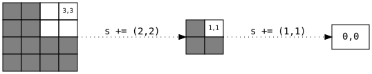
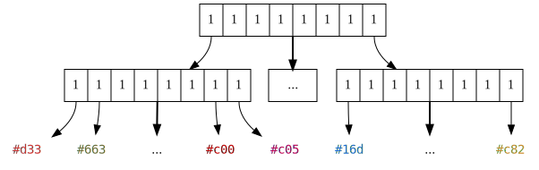
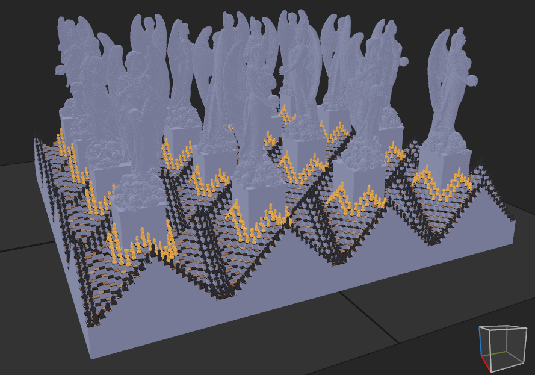
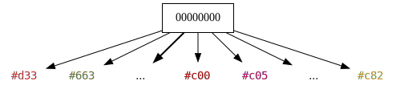

# SVO Optimization

Sparse Voxel Octrees are often sufficiently compact data structures for computer graphics applications.
However, they still contain a large amount of redundancy and have plenty of potential for optimization.

We can differentiate between two types of optimizations: 
**top-down optimizations** optimize nodes starting from the root node and continue downwards.
**bottom-up optimizations** optimize nodes starting from the leafs and continue upwards.

*Top-down optimizations* alter the geometric boundaries of the octree but have little effect on the amount of nodes.
This is due to the fact that in any tree, there are more nodes towards the bottom.
Their primary purpose is accelerating access to the deeper layers.

*Bottom-up optimizations* have no impact on the boundaries of the octree as this solely depends on the maximum depth.
Their primary purpose is decreasing the amount of nodes or reducing nodes in size.

## Single-Octant Optimization

 
*Figure 1: Octree Optimization, where b is a sub-branch (visualized using a Quadtree)*

Once an octree has been fully constructed, unused octants can be optimized or "cut away" recursively.
This can be especially helpful for octrees where all voxels reside very far from the origin.
For instance, we could be encoding voxels with coordinates ranging from 100,000 to 100,050.
Many almost completely empty octree layers would need to be traversed to get to where such locations are stored.
Trimming away such single-octant layers accelerates encoding and decoding.

This is our first and only *top-down optimization*.

### Algorithm

1. $s \gets (0,0,0)$
2. If the root node $r$ has exactly one branch $b$:
    - $s \gets s + 2^{d-2}$
    - $r \gets b$
    - repeat 2.

$2^d$ is the negated minimum point of our current octree, as described in
[Position Normalization](#position-normalization).

After this process has been completed, we simply store $s$ alongside the octree.
When decoding, $s$ is added back onto all found positions.

## Complete Branch Optimization

 
*Figure 2: A Complete (Sub-)Tree*

Observe the *Figure 2* above.
All nodes are completely filled with `1`, representing that their subtree or color is present.
This demonstrates one of the significant weak points of octrees:
They are very good at trimming away air recursively, but have a very high cost when encoding a completely filled
container.

In fact, we would be much better off encoding such containers as arrays than using octrees, as octrees only add 
redundancy and no benefit in this case.
To optimize such cases, we must eliminate nodes which are recursively filled in, or *complete*.
A voxel model that demonstrates this well is *chessmaster3*:

 
*Figure 3: chessmaster3 Model, visualized in Magica Voxel*

A very large portion of this model is completely filled in.
In fact, the cuboid base of this model alone is 1088x1088 large and many voxels tall.
When encoding this model, we see the following results:

| Method | Geometry Bytes |
| ----- | ----- |
SVX              |  1031 KiB
Octree           | 25044 KiB (~24x)
Tetrahexacontree | 22704 KiB (~22x)
Octree Optimized |  1340 KiB (~1.3x)
Thct. Optimized  |  4619 KiB (~4.5x)

So how could we accomplish a seemingly miraculous drop from 24x worse to nearly identical for octrees?
By simply using the *degenerate case* of a zero-node to encode a complete subtree.

 
*Figure 4: The Tree from Figure 2, after optimization.*

Compare the above figure to *Figure 2*. We are eliminating one layer of nodes and going from the root directly to
the color information.
Of course, the above data only includes geometry bytes, not color bytes.
By eliminating such layers, we can save ourselves 8 nodes on the second level from the bottom, 64 nodes on the third,
and so on.

Geometrically, it does not even require a lot of space to be completely filled.
We merely need a 4x4x4 volume of voxels to be complete in order to eliminate 8 nodes.
Tetrahexacontrees do not perform nearly as well though.
They require a 16x16x16 volume to be complete and only then is an optimization possible.
The more squashed an octree becomes, the fewer opportunities there are to optimize it.
