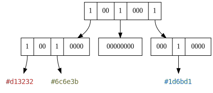
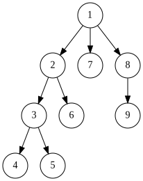
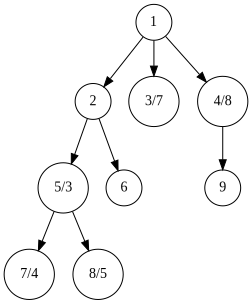
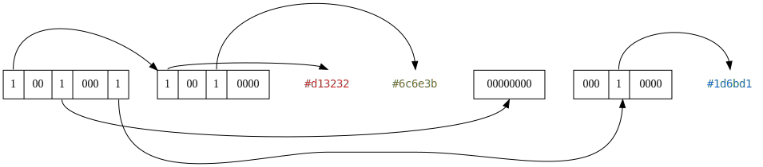
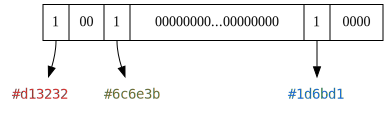

# Sparse Voxel Octree

*An Octree - Source: [Wikipedia](https://commons.wikimedia.org/wiki/File:Octree2.svg), WhiteTimberwolf*

A sparse voxel octree is a data structure which stores voxels in a tree with a branching factor of 8, with its branches
being potentially absent.
Missing branches typically represent empty volumes where no voxels exist.
The greater empty volumes are, the closer to the root can their corresponding subtrees be pruned.

This results in a very efficient representation of models with a significant portion of empty space.
Unlike with a voxel list, all positioning is implicit and results from the tree structure, meaning that no space has
to be used for the storage of coordinates during serialization.
Thus, octrees combine the two greatest advantages of voxel lists and voxel arrays:

- like lists, they waste little space on encoding empty voxels
- like for arrays, voxel coordinates are implicit and little space is wasted

## Extreme Cases And Limits

To illustrate the following extreme cases, voxel arrays and voxel lists are also compared.
The space complexity of three extreme cases is compared between the three data structures, where $v$ is the amount
of voxels.

| | Voxel Array | Voxel List | Sparse Voxel Octree
| ----- | ----- | ----- | ----- |
Empty          | $O(1)$[^1] | $O(1)$ | $O(1)$
Tightly Filled | $O(v)$ | $O(4v)$ | $O(\frac{8}{7} v)$
Stretched      | $O(\infty)$ | $O(1)$ | $O(\infty)$

[^1]: Depends on how much space is pre-allocated before the insertion of any voxels.
      Other data structures consume no space for such a pre-allocation.

##### Empty Octree

Entirely empty models can be encoded using just the root note, which then encodes that no subtrees exist.

##### Tightly Filled Octree

Entirely filled models will have some overhead compared to an array of voxels.
For every eight nodes, there is one parent node.
We can calculate the maximum possible overhead by summing up this $\frac{1}{8}$ overhead infinitely:
$$\sum_{n=1}^\infty{\frac{1}{8}^n} = \frac{1}{7}$$
So at worst, our data will increase by $\frac{1}{7}$, which is much better than a 100% increase such as for binary
trees.

##### Stretched Octree

The *stretched* case is a case where a finite amount of voxels are placed infinitely far apart.
For arrays, this produces infinite space requirements because all space between these points must be filled.
For octrees, more layers are necessary to encode positions further from the origin.
In neither case there is an upper bound to this.

In practice, octrees perform significantly better at encoding sparse data than arrays.

## Construction and Optimization

How an octree can be constructed from a list voxels is thorougly explained in [SVO Construction](construction.md).

After the octree has been constructed, it will often be necessary to optimize its structure.
See [SVO Optimization](optimization.md).

## Serialization

 
*Figure 0: A Sparse Voxel Octree, encoded in memory*

To be used in a serial data format, octrees must first be serialized.
Nodes will no longer be laid out freely in memory but instead be arranged one after another.
To fully encode an SVO, two steps must be performed:

1. Linearize nodes by traversing the SVO's nodes in a deterministic, reversible order.
2. Serialize each node to binary data.

### Traversal Order

There are two well-known strategies for traversing trees completely:

- Depth-First Search (DFS)
- Breadth-First Search (BFS)

We improve upon Depth-First Search using our own novel method, Accelerated Depth-First Search (ADFS).
The main points of comparison are as follows:

| Method | Space | Data Structure | Bulk-Read Possible
| ----- | ----- | ----- | ----- |
| DFS  | $O(\log{v})$ | Stack of Nodes      | never
| BFS  | $O(v)$       | Queue               | for entire layer
| ADFS | $O(\log{v})$ | Stack of Node Lists | for direct children

#### Depth-First

 
*Figure 1: Tree, traversed depth-first*

DFS can be performed using only a stack to keep track of the node number at each level.
On the deepest level, the next node is chosen until the end is reached and the next parent node is chosen.
This low memory cost (which is in fact $O(\log{n})$ where n is the number of nodes) is highly advantageous when encoding
enormous models.

<h4 id="breadth-first"> Breadth-First</h4>

 
*Figure 2: Tree, traversed breadth-first*

BFS comes with a higher cost since a typical algorithm appends all branches to a queue for every traversed node.
This means that in the worst case, which is at the beginning of serialization eight nodes are appended on every level
before any node is popped from the queue, resulting in a higher memory cost.

<h4 id="acc-depth-first">Accelerated Depth-First</h4>

 
*Figure 3: Tree, traversed depth-first*

In *Figure 3*, the labels symbolize `order of storage`**/**`order of visitation`.

Accelerated Depth-First is similar to DFS, however all direct children of the current node are stored first.
So for example, we store all direct children (2, 3, 4) of the root node (1), but then continue onward to 2
(without storing 2 again) as though we
were performing regular DFS.

##### Implementation

The implementation is trivial if we are already capable of performing DFS.
Instead of storing the node which we visit during DFS, we store all of its children.

When we visit the next node, it has always already been written because it is the child of some previous node.
Of course this is not true for the root node, which we need to store first.

##### Advantages

When we are decoding a format in which a node stores the connections to its child nodes,
we can count the number of connections and read multiple nodes simultaneously.
This is the main benefit of this method.
Regular DFS requires us to inspect one connection at a time, then go one node deeper into the tree if it is set.
A bulk-read is never possible.

An obvious prerequisite is that the nodes are encoded in a fixed-length format, otherwise we can't
safely perform such a bulk-read.
We can still use just a stack as a data structure, but we need to store a list at every depth with the cached nodes.

!!! note
    This approach was specially invented for this research project.
    Any previous use of it is unknown to me.

#### Why To Serialize Octrees Depth-First and not Breadth-First

 
*Figure 4: A serialized octree, depth-first*

The scheme more practical for encoding octrees is depth-first.
This is due to the fact that only a stack is necessary to keep track of the current position.
The size or depth of the octree would need to double in all dimensions to necessitate a stack greater by one element.
Overall, this is a very low memory profile.

For breadth first, we would always load information about the entire next deeper layer into our queue, then move on.
To be fair, this does allow us to discard the previous layer entirely once we move deeper, but the memory cost is still
unnecessarily high.

### Node Encoding

In the above graphs, the 1-bit encoding was demonstrated due to its simplicity.
However, there is a variety of different encodings to choose from.

#### Single-Bit Format

* `0` stands for air-subtree
* `1` stands for partially or entirely filled voxel-subtree

8 Bits per octree-node, thus this format is byte-aligned.

#### 2-Bit Format

* `00` stands for air-subtree
* `01` stands for solid subtree
* `10` stands for partially filled subtree
* `11` variable purpose

#### 1.5-Bit Format

* `00` stands for air-subtree
* `01` stands for solid subtree
* `1`  stands for partially filled subtree

Variable amount of bits per octree-node, neither bit- nor byte-aligned.
On the last level (node = voxel), the single-bit format is used because there are no subtrees.

##### `11` for Raw/Array Subtrees

Useful to encode subtrees completely filled with high-entropy content.
On the second-to-last level, `11` for raw-subtrees there is no difference between `10` and `11`, so reverting to
the 1.5-bit format is viable.
On the last level, the single-bit format should be used.

As long as the 1.5-bit format is not used, this encoding is completely byte-aligned:
* alignment to `16`-bit boundaries on most levels
* alignment to `8`-bit boundaries on last level

##### `11` for Pointers to Subtrees on the Same Level

Useful for encoding multiple similar subtrees.
Similarities between structures could be effectively exploited.
Verifying whether subtrees are equal down to the base level has very high complexity: `O(n^2 * 8^n)`.
The comparison depth could be reduced down to a limited number of levels or the level number could be encoded next to
the pointer: `{u32 indexOfOtherTree, u8 depth}`.

Instead of the pointer, a tree could instead encode all the places where it is additionally used.
This would make decoding easier, since remembering trees on the same level is not necessary.

### Degenerate Cases

If you paid close attention to *Figure 1* and *Figure 3*, you will have noticed that they contain a `00000000` node.
Such nodes can in principle exist, but are a waste of space.
After all, they could be trimmed away one layer above by simply encoding a `0`-bit.
This nonsensical nature is why they are considered to be a *degenerate case*.

Such cases can however be useful.
They offer a natural [escape sequence](https://en.wikipedia.org/wiki/Escape_sequence) from the regular encoding of
an SVO.
They could offer special functionality as seen in `3.2.3` to the single-bit format, which does not have
any unused values.

## Squashed Octrees

 
*Figure 5: A squashed Octree (compare to Figure 0)*

A squashed octree is an octree where two or more layers of the tree have been combined into a single layer.

By squashing an octree once, we receive a tetrahexacontree.
This term comes from "tetrahexaconta" (Greek for 64) and "tree".
It builds on the idea of octrees but expands the branching factor from 8 to 82, or 64.
In almost all regards, a squashed octree is implemented identically to a regular octree.
However, we divide space into a 4x4x4 cube instead of a 2x2x2 cube with each layer.

### Motivation

When serializing or deserializing an octree, we must do so node by node.
This involves generating a bitmask (see above sections on node encoding).
For a tetrahexacontree and under use of the 1-bit format, we fill exactly one CPU register on a 64-bit architecture
with our nodes.
With a regular octree, we would waste all but eight bits.

64-bit architectures established themselves as the de-facto standard for desktop operating systems.
Anecdotally, "macOS Mojave would be the last version of macOS to run 32-bit apps"
-[Apple](https://support.apple.com/en-us/HT208436).
Thus, optimization of algorithms in the present day can be performed for 64-bit architectures without worrying about
32-bit users.

A use of this concept can be seen in the
[VOLA](../related/literature.md#vola-a-compact-volumetric-format-for-3d-mapping-and-embedded-systems) file format.
VOLA uses a 1-bit format for its nodes while squashing two layers into one.
So VOLA uses a tetrahexacontree.
Unfortunately the paper fails to mention how performance and compression efficiency can be gained or lost this way.
Therefore, we run our own tests in the following subsections.

### Performance Benefits

Squashed SVOs lead to very significant performance benefits.
For instance, when storing our *Ragged Cluster* model voxel-by-voxel in our SVO, this took:

- for a regular SVO: 1700-1800 ms
- for a squashed SVO: 1048-1288 ms

It would be a realistic estimate to say that a 100% speedup is possible.

### Spatial Costs

The costs of one squash are almost neglegible.
For instance, our *Ragged Cluster* model requires:

- for a regular SVO:  50,467,464 node bits in single-bit format
- for a squashed SVO: 50,566,592 node bits in single-bit format

That is a mere 0.196% increase in bits.
However, while by a slim margin, a tetrahexacontree will almost always perform slightly worse:

#### Best Case for Regular Octrees

In the best case which is an entirely empty node, an octree requires only one byte of space to encode that each of the
8 child-nodes are empty.
A tetrahexacontree will however require eight times the space, meaning 64 bits that are all `0`.
However, octrees are very good at trimming away large empty volumes.
For our *Ragged Cluser*, **the average sub-branch count was 6.901**, meaning that in each node we would most likely see
7 out of 8 bits set.
So this best case is rarely encountered.

#### Best Case for Squashed Octrees

The only case where a squashed octree is more efficient than a regular octree is  the case where all sub-branches exist.
This would be one root-node and 8 branches for a regular octree.
Thanks to the squash, this this would only be a single node for a tetrahexacontree, but eight times as large.
For our *Ragged Cluser*, **the average squashed sub-branch count was 35.78**.
So we are far from encountering this completely-filled case.

### Squashing More than One Layer

In principle we squash even more layers, to receive a tree with a branching factor of 512 and higher.
However, we would not receive architectural benefits anymore and would lose out on even more compression efficiency.

### Conclusion

Tetrahexacontrees provide nearly identical spatial costs while providing a very significant performance improvement.
This result does have broad implications for the use of octrees in computer graphics in general.
Many ray casting algorithms would likely benefits from higher branching factors.

In our case, we will follow the example of the
[VOLA](../related/literature.md#vola-a-compact-volumetric-format-for-3d-mapping-and-embedded-systems) file
format and use a higher branching factor in our encoding scheme.
